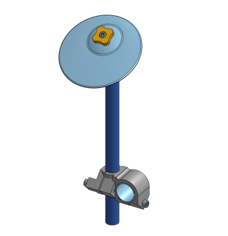

# Open Source E-Cymbal V1
An open source e-drum cymbal and stand you can build yourself!

## Files available
* 3D STEP
* STL

## BOM V1

| Item | Quantity | Name                                     | Part-Number              |
| ---- | -------- | ---------------------------------------- | ------------------------ |
| 1    | 1        | Ball                                     | 3D Printed               |
| 2    | 1        | Ball Outer Clamp                         | 3D Printed               |
| 3    | 2        | Felt                                     | Cut foam or felt         |
| 4    | 1        | Knob                                     | 3D Printed               |
| 5    | 1        | Tube Expander                            | 3D Printed               |
| 6    | 1        | Clamp                                    | 3D Printed               |
| 7    | 1        | Sleeve                                   | 3D Printed               |
| 8    | 1        | Aluminum Tube 3/4" OD                    | Any local metal supplier |
| 9    | 1        | Cymbal                                   | 3D Printed               |
| 10   | 6        | Hex socket head cap screw M6x1.00 x 40   | McMaster 90128A268       |
| 11   | 1        | Prevailing torque hex flange nut M6x1.00 | McMaster 92461A300       |
| 12   | 1        | Piezo Element 25mm                       | DigiKey 7BB-27-4L0       |

## Visit the blogpost
[More details here.](https://woodencase01.netlify.app/blog/the-open-source-drum-e-cymbal-v1/)